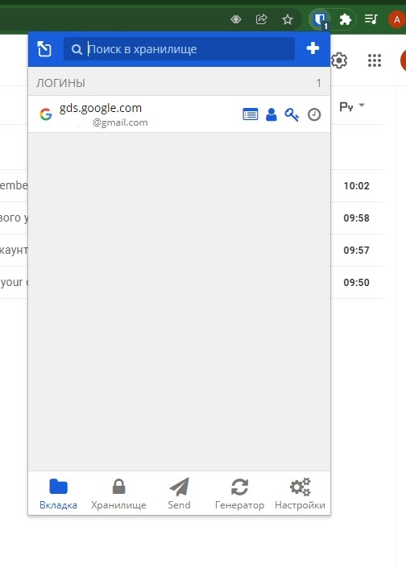
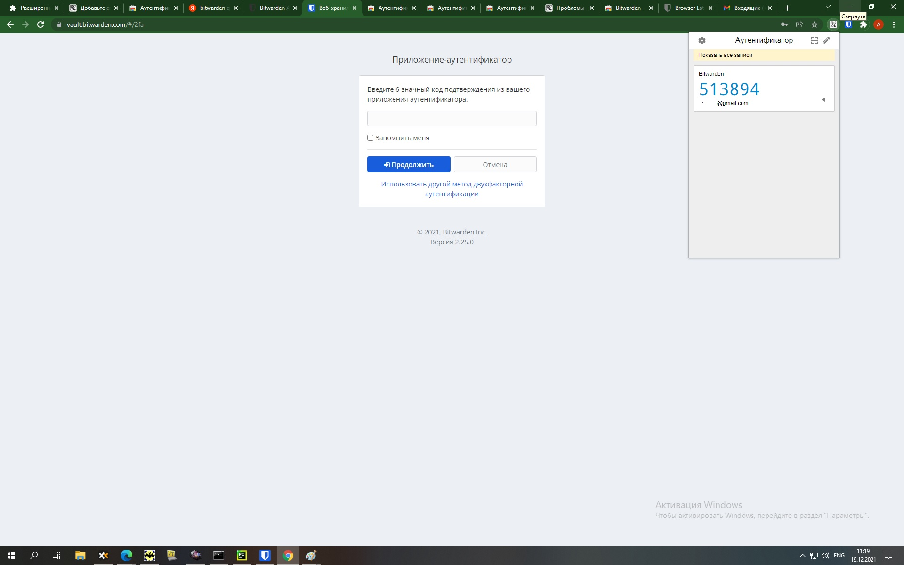
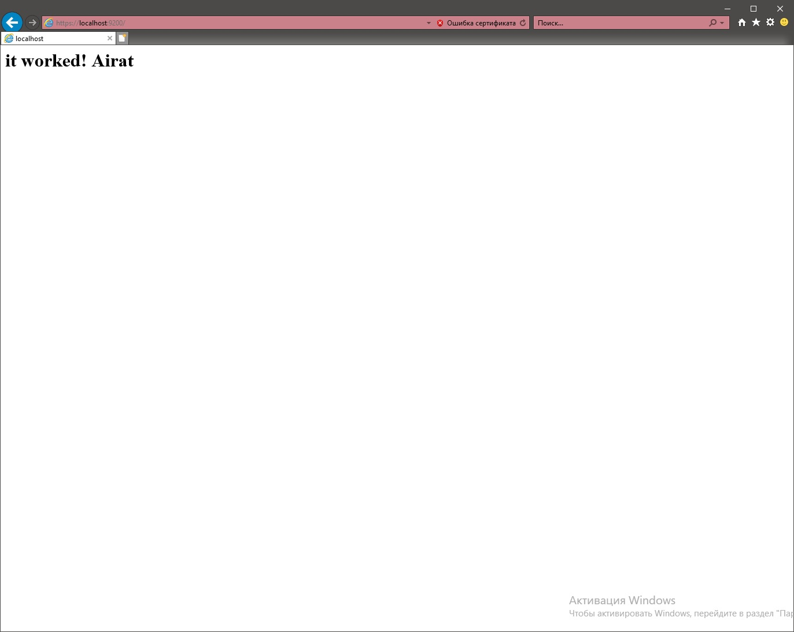
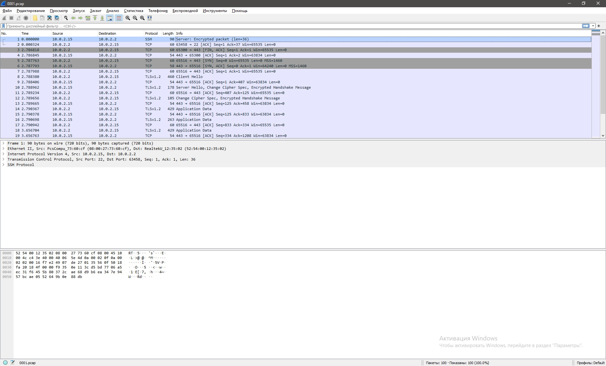

ДЗ 3_9

###### **1. Задание**



###### **2. Задание**

Настроил на компьютере 



###### **3. Задание**


```

vagrant@vagrant:~$ sudo openssl req -x509 -nodes -days 365 -newkey rsa:2048 -keyout /etc/ssl/private/apache-selfsigned.key -out /etc/ssl/certs/apache-selfsigned.crt -subj "/C=RU/ST=Moscow/L=Akhmetzyanov/O=Airat/OU=Org/CN=www.example.com"
Generating a RSA private key
...........+++++
.................................................+++++
writing new private key to '/etc/ssl/private/apache-selfsigned.key'
-----
vagrant@vagrant:~$
 sudo vim /etc/apache2/sites-available/mylocal.conf
 
 <VirtualHost *:443>   
ServerName mylocal   
DocumentRoot /var/www/mylocal   
SSLEngine on   
SSLCertificateFile /etc/ssl/certs/apache-selfsigned.crt   
SSLCertificateKeyFile /etc/ssl/private/apache-selfsigned.key
</VirtualHost>

vagrant@vagrant:~$ sudo ss -ltupn
Netid  State    Recv-Q   Send-Q      Local Address:Port      Peer Address:Port  Process
tcp    LISTEN   0        511                     *:80                   *:*      users:(("apache2",pid=6569,fd=4),("apache2",pid=6517,fd=4),("apache2",pid=817,fd=4))
tcp    LISTEN   0        511                     *:443                  *:*      users:(("apache2",pid=6569,fd=6),("apache2",pid=6517,fd=6),("apache2",pid=817,fd=6))


root@vagrant:/var/www/10.0.2.15# cat index.html
<h1>it worked!
Airat
</h1>


```




###### **4. Задание**

```
vagrant@vagrant:~/testssl/testssl.sh$ ./testssl.sh -U --sneaky https://www.google.com/

###########################################################
    testssl.sh       3.1dev from https://testssl.sh/dev/
    (2201a28 2021-12-13 18:24:34 -- )

      This program is free software. Distribution and
             modification under GPLv2 permitted.
      USAGE w/o ANY WARRANTY. USE IT AT YOUR OWN RISK!

       Please file bugs @ https://testssl.sh/bugs/

###########################################################

 Using "OpenSSL 1.0.2-chacha (1.0.2k-dev)" [~183 ciphers]
 on vagrant:./bin/openssl.Linux.x86_64
 (built: "Jan 18 17:12:17 2019", platform: "linux-x86_64")


Testing all IPv4 addresses (port 443): 64.233.165.147 64.233.165.103 64.233.165.105 64.233.165.104 64.233.165.106 64.233.165.99
---------------------------------------------------------------------------------------------------------------
 Start 2021-12-19 08:37:04        -->> 64.233.165.147:443 (www.google.com) <<--

 Further IP addresses:   64.233.165.99 64.233.165.106 64.233.165.104 64.233.165.105 64.233.165.103
 rDNS (64.233.165.147):  lg-in-f147.1e100.net.
 Service detected:       HTTP


 Testing vulnerabilities

 Heartbleed (CVE-2014-0160)                not vulnerable (OK), no heartbeat extension
 CCS (CVE-2014-0224)                       not vulnerable (OK)
 Ticketbleed (CVE-2016-9244), experiment.  not vulnerable (OK)
 ROBOT                                     not vulnerable (OK)
 Secure Renegotiation (RFC 5746)           supported (OK)
 Secure Client-Initiated Renegotiation     not vulnerable (OK)
 CRIME, TLS (CVE-2012-4929)                not vulnerable (OK)
 BREACH (CVE-2013-3587)                    potentially NOT ok, "br gzip" HTTP compression detected. - only supplied "/" tested
                                           Can be ignored for static pages or if no secrets in the page
 POODLE, SSL (CVE-2014-3566)               not vulnerable (OK)
 TLS_FALLBACK_SCSV (RFC 7507)              Downgrade attack prevention supported (OK)
 SWEET32 (CVE-2016-2183, CVE-2016-6329)    VULNERABLE, uses 64 bit block ciphers
 FREAK (CVE-2015-0204)                     not vulnerable (OK)
 DROWN (CVE-2016-0800, CVE-2016-0703)      not vulnerable on this host and port (OK)
                                           make sure you don't use this certificate elsewhere with SSLv2 enabled services
                                           https://censys.io/ipv4?q=0298F617D11DA008B87DC59F932885BF2108F97C605E48E6AB166170610B39D7 could help you to find out
 LOGJAM (CVE-2015-4000), experimental      not vulnerable (OK): no DH EXPORT ciphers, no DH key detected with <= TLS 1.2
 BEAST (CVE-2011-3389)                     TLS1: ECDHE-ECDSA-AES128-SHA ECDHE-ECDSA-AES256-SHA ECDHE-RSA-AES128-SHA ECDHE-RSA-AES256-SHA AES128-SHA AES256-SHA
                                                 DES-CBC3-SHA
                                           VULNERABLE -- but also supports higher protocols  TLSv1.1 TLSv1.2 (likely mitigated)
 LUCKY13 (CVE-2013-0169), experimental     potentially VULNERABLE, uses cipher block chaining (CBC) ciphers with TLS. Check patches
 Winshock (CVE-2014-6321), experimental    not vulnerable (OK)
 RC4 (CVE-2013-2566, CVE-2015-2808)        no RC4 ciphers detected (OK)


 Done 2021-12-19 08:37:44 [  44s] -->> 64.233.165.147:443 (www.google.com) <<--

---------------------------------------------------------------------------------------------------------------
 Start 2021-12-19 08:37:44        -->> 64.233.165.103:443 (www.google.com) <<--

 Further IP addresses:   64.233.165.99 64.233.165.106 64.233.165.104 64.233.165.105 64.233.165.147
 rDNS (64.233.165.103):  lg-in-f103.1e100.net.
 Service detected:       HTTP


 Testing vulnerabilities

 Heartbleed (CVE-2014-0160)                not vulnerable (OK), no heartbeat extension
 CCS (CVE-2014-0224)                       not vulnerable (OK)
 Ticketbleed (CVE-2016-9244), experiment.  not vulnerable (OK)
 ROBOT                                     not vulnerable (OK)
 Secure Renegotiation (RFC 5746)           supported (OK)
 Secure Client-Initiated Renegotiation     not vulnerable (OK)
 CRIME, TLS (CVE-2012-4929)                not vulnerable (OK)
 BREACH (CVE-2013-3587)                    potentially NOT ok, "br gzip" HTTP compression detected. - only supplied "/" tested
                                           Can be ignored for static pages or if no secrets in the page
 POODLE, SSL (CVE-2014-3566)               not vulnerable (OK)
 TLS_FALLBACK_SCSV (RFC 7507)              Downgrade attack prevention supported (OK)
 SWEET32 (CVE-2016-2183, CVE-2016-6329)    VULNERABLE, uses 64 bit block ciphers
 FREAK (CVE-2015-0204)                     not vulnerable (OK)
 DROWN (CVE-2016-0800, CVE-2016-0703)      not vulnerable on this host and port (OK)
                                           make sure you don't use this certificate elsewhere with SSLv2 enabled services
                                           https://censys.io/ipv4?q=0298F617D11DA008B87DC59F932885BF2108F97C605E48E6AB166170610B39D7 could help you to find out
 LOGJAM (CVE-2015-4000), experimental      not vulnerable (OK): no DH EXPORT ciphers, no DH key detected with <= TLS 1.2
 BEAST (CVE-2011-3389)                     TLS1: ECDHE-ECDSA-AES128-SHA ECDHE-ECDSA-AES256-SHA ECDHE-RSA-AES128-SHA ECDHE-RSA-AES256-SHA AES128-SHA AES256-SHA
                                                 DES-CBC3-SHA
                                           VULNERABLE -- but also supports higher protocols  TLSv1.1 TLSv1.2 (likely mitigated)
 LUCKY13 (CVE-2013-0169), experimental     potentially VULNERABLE, uses cipher block chaining (CBC) ciphers with TLS. Check patches
 Winshock (CVE-2014-6321), experimental    not vulnerable (OK)
 RC4 (CVE-2013-2566, CVE-2015-2808)        no RC4 ciphers detected (OK)


 Done 2021-12-19 08:38:25 [  85s] -->> 64.233.165.103:443 (www.google.com) <<--

---------------------------------------------------------------------------------------------------------------
 Start 2021-12-19 08:38:26        -->> 64.233.165.105:443 (www.google.com) <<--

 Further IP addresses:   64.233.165.99 64.233.165.106 64.233.165.104 64.233.165.103 64.233.165.147
 rDNS (64.233.165.105):  lg-in-f105.1e100.net.
 Service detected:       HTTP


 Testing vulnerabilities

 Heartbleed (CVE-2014-0160)                not vulnerable (OK), no heartbeat extension
 CCS (CVE-2014-0224)                       not vulnerable (OK)
 Ticketbleed (CVE-2016-9244), experiment.  not vulnerable (OK)
 ROBOT                                     not vulnerable (OK)
 Secure Renegotiation (RFC 5746)           supported (OK)
 Secure Client-Initiated Renegotiation     not vulnerable (OK)
 CRIME, TLS (CVE-2012-4929)                not vulnerable (OK)
 BREACH (CVE-2013-3587)                    potentially NOT ok, "br gzip" HTTP compression detected. - only supplied "/" tested
                                           Can be ignored for static pages or if no secrets in the page
 POODLE, SSL (CVE-2014-3566)               not vulnerable (OK)
 TLS_FALLBACK_SCSV (RFC 7507)              Downgrade attack prevention supported (OK)
 SWEET32 (CVE-2016-2183, CVE-2016-6329)    VULNERABLE, uses 64 bit block ciphers
 FREAK (CVE-2015-0204)                     not vulnerable (OK)
 DROWN (CVE-2016-0800, CVE-2016-0703)      not vulnerable on this host and port (OK)
                                           make sure you don't use this certificate elsewhere with SSLv2 enabled services
                                           https://censys.io/ipv4?q=0298F617D11DA008B87DC59F932885BF2108F97C605E48E6AB166170610B39D7 could help you to find out
 LOGJAM (CVE-2015-4000), experimental      not vulnerable (OK): no DH EXPORT ciphers, no DH key detected with <= TLS 1.2
 BEAST (CVE-2011-3389)                     TLS1: ECDHE-ECDSA-AES128-SHA ECDHE-ECDSA-AES256-SHA ECDHE-RSA-AES128-SHA ECDHE-RSA-AES256-SHA AES128-SHA AES256-SHA
                                                 DES-CBC3-SHA
                                           VULNERABLE -- but also supports higher protocols  TLSv1.1 TLSv1.2 (likely mitigated)
 LUCKY13 (CVE-2013-0169), experimental     potentially VULNERABLE, uses cipher block chaining (CBC) ciphers with TLS. Check patches
 Winshock (CVE-2014-6321), experimental    not vulnerable (OK)
 RC4 (CVE-2013-2566, CVE-2015-2808)        no RC4 ciphers detected (OK)


 Done 2021-12-19 08:39:10 [ 130s] -->> 64.233.165.105:443 (www.google.com) <<--

---------------------------------------------------------------------------------------------------------------
 Start 2021-12-19 08:39:10        -->> 64.233.165.104:443 (www.google.com) <<--

 Further IP addresses:   64.233.165.99 64.233.165.106 64.233.165.105 64.233.165.103 64.233.165.147
 rDNS (64.233.165.104):  lg-in-f104.1e100.net.
 Service detected:       HTTP


 Testing vulnerabilities

 Heartbleed (CVE-2014-0160)                not vulnerable (OK), no heartbeat extension
 CCS (CVE-2014-0224)                       not vulnerable (OK)
 Ticketbleed (CVE-2016-9244), experiment.  not vulnerable (OK)
 ROBOT                                     not vulnerable (OK)
 Secure Renegotiation (RFC 5746)           supported (OK)
 Secure Client-Initiated Renegotiation     not vulnerable (OK)
 CRIME, TLS (CVE-2012-4929)                not vulnerable (OK)
 BREACH (CVE-2013-3587)                    potentially NOT ok, "br gzip" HTTP compression detected. - only supplied "/" tested
                                           Can be ignored for static pages or if no secrets in the page
 POODLE, SSL (CVE-2014-3566)               not vulnerable (OK)
 TLS_FALLBACK_SCSV (RFC 7507)              Downgrade attack prevention supported (OK)
 SWEET32 (CVE-2016-2183, CVE-2016-6329)    VULNERABLE, uses 64 bit block ciphers
 FREAK (CVE-2015-0204)                     not vulnerable (OK)
 DROWN (CVE-2016-0800, CVE-2016-0703)      not vulnerable on this host and port (OK)
                                           make sure you don't use this certificate elsewhere with SSLv2 enabled services
                                           https://censys.io/ipv4?q=0298F617D11DA008B87DC59F932885BF2108F97C605E48E6AB166170610B39D7 could help you to find out
 LOGJAM (CVE-2015-4000), experimental      not vulnerable (OK): no DH EXPORT ciphers, no DH key detected with <= TLS 1.2
 BEAST (CVE-2011-3389)                     TLS1: ECDHE-ECDSA-AES128-SHA ECDHE-ECDSA-AES256-SHA ECDHE-RSA-AES128-SHA ECDHE-RSA-AES256-SHA AES128-SHA AES256-SHA
                                                 DES-CBC3-SHA
                                           VULNERABLE -- but also supports higher protocols  TLSv1.1 TLSv1.2 (likely mitigated)
 LUCKY13 (CVE-2013-0169), experimental     potentially VULNERABLE, uses cipher block chaining (CBC) ciphers with TLS. Check patches
 Winshock (CVE-2014-6321), experimental    not vulnerable (OK)
 RC4 (CVE-2013-2566, CVE-2015-2808)        no RC4 ciphers detected (OK)


 Done 2021-12-19 08:39:54 [ 174s] -->> 64.233.165.104:443 (www.google.com) <<--

---------------------------------------------------------------------------------------------------------------
 Start 2021-12-19 08:39:54        -->> 64.233.165.106:443 (www.google.com) <<--

 Further IP addresses:   64.233.165.99 64.233.165.104 64.233.165.105 64.233.165.103 64.233.165.147
 rDNS (64.233.165.106):  lg-in-f106.1e100.net.
 Service detected:       HTTP


 Testing vulnerabilities

 Heartbleed (CVE-2014-0160)                not vulnerable (OK), no heartbeat extension
 CCS (CVE-2014-0224)                       not vulnerable (OK)
 Ticketbleed (CVE-2016-9244), experiment.  not vulnerable (OK)
 ROBOT                                     not vulnerable (OK)
 Secure Renegotiation (RFC 5746)           supported (OK)
 Secure Client-Initiated Renegotiation     not vulnerable (OK)
 CRIME, TLS (CVE-2012-4929)                not vulnerable (OK)
 BREACH (CVE-2013-3587)                    potentially NOT ok, "br gzip" HTTP compression detected. - only supplied "/" tested
                                           Can be ignored for static pages or if no secrets in the page
 POODLE, SSL (CVE-2014-3566)               not vulnerable (OK)
 TLS_FALLBACK_SCSV (RFC 7507)              Downgrade attack prevention supported (OK)
 SWEET32 (CVE-2016-2183, CVE-2016-6329)    VULNERABLE, uses 64 bit block ciphers
 FREAK (CVE-2015-0204)                     not vulnerable (OK)
 DROWN (CVE-2016-0800, CVE-2016-0703)      not vulnerable on this host and port (OK)
                                           make sure you don't use this certificate elsewhere with SSLv2 enabled services
                                           https://censys.io/ipv4?q=0298F617D11DA008B87DC59F932885BF2108F97C605E48E6AB166170610B39D7 could help you to find out
 LOGJAM (CVE-2015-4000), experimental      not vulnerable (OK): no DH EXPORT ciphers, no DH key detected with <= TLS 1.2
 BEAST (CVE-2011-3389)                     TLS1: ECDHE-ECDSA-AES128-SHA ECDHE-ECDSA-AES256-SHA ECDHE-RSA-AES128-SHA ECDHE-RSA-AES256-SHA AES128-SHA AES256-SHA
                                                 DES-CBC3-SHA
                                           VULNERABLE -- but also supports higher protocols  TLSv1.1 TLSv1.2 (likely mitigated)
 LUCKY13 (CVE-2013-0169), experimental     potentially VULNERABLE, uses cipher block chaining (CBC) ciphers with TLS. Check patches
 Winshock (CVE-2014-6321), experimental    not vulnerable (OK)
 RC4 (CVE-2013-2566, CVE-2015-2808)        no RC4 ciphers detected (OK)


 Done 2021-12-19 08:40:37 [ 217s] -->> 64.233.165.106:443 (www.google.com) <<--

---------------------------------------------------------------------------------------------------------------
 Start 2021-12-19 08:40:37        -->> 64.233.165.99:443 (www.google.com) <<--

 Further IP addresses:   64.233.165.106 64.233.165.104 64.233.165.105 64.233.165.103 64.233.165.147
 rDNS (64.233.165.99):   lg-in-f99.1e100.net.
 Service detected:       HTTP


 Testing vulnerabilities

 Heartbleed (CVE-2014-0160)                not vulnerable (OK), no heartbeat extension
 CCS (CVE-2014-0224)                       not vulnerable (OK)
 Ticketbleed (CVE-2016-9244), experiment.  not vulnerable (OK)
 ROBOT                                     not vulnerable (OK)
 Secure Renegotiation (RFC 5746)           supported (OK)
 Secure Client-Initiated Renegotiation     not vulnerable (OK)
 CRIME, TLS (CVE-2012-4929)                not vulnerable (OK)
 BREACH (CVE-2013-3587)                    potentially NOT ok, "br gzip" HTTP compression detected. - only supplied "/" tested
                                           Can be ignored for static pages or if no secrets in the page
 POODLE, SSL (CVE-2014-3566)               not vulnerable (OK)
 TLS_FALLBACK_SCSV (RFC 7507)              Downgrade attack prevention supported (OK)
 SWEET32 (CVE-2016-2183, CVE-2016-6329)    VULNERABLE, uses 64 bit block ciphers
 FREAK (CVE-2015-0204)                     not vulnerable (OK)
 DROWN (CVE-2016-0800, CVE-2016-0703)      not vulnerable on this host and port (OK)
                                           make sure you don't use this certificate elsewhere with SSLv2 enabled services
                                           https://censys.io/ipv4?q=0298F617D11DA008B87DC59F932885BF2108F97C605E48E6AB166170610B39D7 could help you to find out
 LOGJAM (CVE-2015-4000), experimental      not vulnerable (OK): no DH EXPORT ciphers, no DH key detected with <= TLS 1.2
 BEAST (CVE-2011-3389)                     TLS1: ECDHE-ECDSA-AES128-SHA ECDHE-ECDSA-AES256-SHA ECDHE-RSA-AES128-SHA ECDHE-RSA-AES256-SHA AES128-SHA AES256-SHA
                                                 DES-CBC3-SHA
                                           VULNERABLE -- but also supports higher protocols  TLSv1.1 TLSv1.2 (likely mitigated)
 LUCKY13 (CVE-2013-0169), experimental     potentially VULNERABLE, uses cipher block chaining (CBC) ciphers with TLS. Check patches
 Winshock (CVE-2014-6321), experimental    not vulnerable (OK)
 RC4 (CVE-2013-2566, CVE-2015-2808)        no RC4 ciphers detected (OK)


 Done 2021-12-19 08:41:22 [ 262s] -->> 64.233.165.99:443 (www.google.com) <<--

---------------------------------------------------------------------------------------------------------------
Done testing now all IP addresses (on port 443): 64.233.165.147 64.233.165.103 64.233.165.105 64.233.165.104 64.233.165.106 64.233.165.99

vagrant@vagrant:~/testssl/testssl.sh$
```

###### **5.Задание**

Проверка на рабочих серверах с FreeBSD

```
zeta# ssh root@192.168.1.101
Last login: Sun Dec 19 12:09:58 2021 from 192.168.1.100
FreeBSD 9.1-RELEASE-p4 (GENERIC) #0 r252372M: Sat Jun 29 22:04:08 MSK 2013

Welcome to FreeBSD!

Before seeking technical support, please use the following resources:

o  Security advisories and updated errata information for all releases are
   at http://www.FreeBSD.org/releases/ - always consult the ERRATA section
   for your release first as it's updated frequently.

o  The Handbook and FAQ documents are at http://www.FreeBSD.org/ and,
   along with the mailing lists, can be searched by going to
   http://www.FreeBSD.org/search/.  If the doc package has been installed
   (or fetched via pkg_add -r lang-freebsd-doc, where lang is the
   2-letter language code, e.g. en), they are also available formatted
   in /usr/local/share/doc/freebsd.

If you still have a question or problem, please take the output of
`uname -a', along with any relevant error messages, and email it
as a question to the questions@FreeBSD.org mailing list.  If you are
unfamiliar with FreeBSD's directory layout, please refer to the hier(7)
manual page.  If you are not familiar with manual pages, type `man man'.

Edit /etc/motd to change this login announcement.

root@ETNA:/root #
```

###### **6.Задание**


Подключение по не стандартному ключу 

```
zeta# ssh -i ~/.ssh/my_id_rsa root@192.168.1.101
Last login: Sun Dec 19 12:40:26 2021 from 192.168.1.100
FreeBSD 9.1-RELEASE-p4 (GENERIC) #0 r252372M: Sat Jun 29 22:04:08 MSK 2013

Welcome to FreeBSD!

Before seeking technical support, please use the following resources:

o  Security advisories and updated errata information for all releases are
   at http://www.FreeBSD.org/releases/ - always consult the ERRATA section
   for your release first as it's updated frequently.

o  The Handbook and FAQ documents are at http://www.FreeBSD.org/ and,
   along with the mailing lists, can be searched by going to
   http://www.FreeBSD.org/search/.  If the doc package has been installed
   (or fetched via pkg_add -r lang-freebsd-doc, where lang is the
   2-letter language code, e.g. en), they are also available formatted
   in /usr/local/share/doc/freebsd.

If you still have a question or problem, please take the output of
`uname -a', along with any relevant error messages, and email it
as a question to the questions@FreeBSD.org mailing list.  If you are
unfamiliar with FreeBSD's directory layout, please refer to the hier(7)
manual page.  If you are not familiar with manual pages, type `man man'.

Edit /etc/motd to change this login announcement.

root@ETNA:/root #


```

###### **7.Задание**
```
vagrant@vagrant:~$ sudo tcpdump -c 100 -w 0001.pcap -i eth0
tcpdump: listening on eth0, link-type EN10MB (Ethernet), capture size 262144 bytes
100 packets captured
100 packets received by filter
0 packets dropped by kernel
vagrant@vagrant:~$


```


