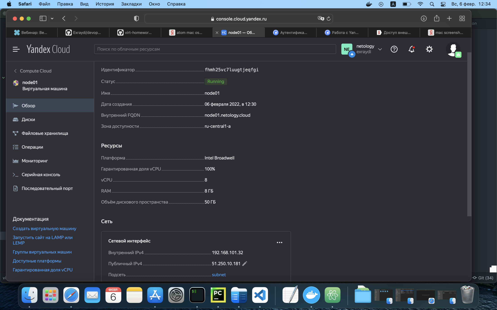

---


# Домашнее задание к занятию 5.4
## Обязательная задача 1

```
airat@MacBook packer % yc compute image list
+----------------------+---------------+--------+----------------------+--------+
|          ID          |     NAME      | FAMILY |     PRODUCT IDS      | STATUS |
+----------------------+---------------+--------+----------------------+--------+
| fd8c3f80q0cnqtp91up2 | centos-7-base | centos | f2eacrudv331nbat9ehb | READY  |
+----------------------+---------------+--------+----------------------+--------+

airat@MacBook packer %

```


## Обязательная задача 2





## Обязательная задача 3


