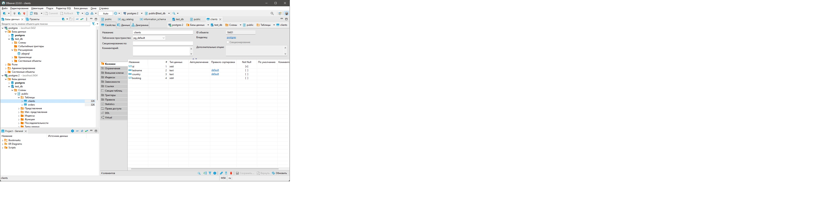

---


# Домашнее задание к занятию 6.2
## Обязательная задача 1

```
vagrant@vagrant:~$ sudo docker pull postgres:12
12: Pulling from library/postgres
5eb5b503b376: Pull complete
daa0467a6c48: Pull complete
7cf625de49ef: Pull complete
bb8afcc973b2: Pull complete
c74bf40d29ee: Pull complete
2ceaf201bb22: Pull complete
1255f255c0eb: Pull complete
12a9879c7aa1: Pull complete
f7ca80cc6dd3: Pull complete
6714db455645: Pull complete
ee4f5626bf60: Pull complete
621bb0c2ae77: Pull complete
a19e980f0a72: Pull complete
Digest: sha256:505d023f030cdea84a42d580c2a4a0e17bbb3e91c30b2aea9c02f2dfb10325ba
Status: Downloaded newer image for postgres:12
docker.io/library/postgres:12
vagrant@vagrant:~$ docker volume create vol2
Got permission denied while trying to connect to the Docker daemon socket at unix:///var/run/docker.sock: Post "http://%2Fvar%2Frun%2Fdocker.sock/v1.24/volumes/create": dial unix /var/run/docker.sock: connect: permission denied
vagrant@vagrant:~$ sudo docker volume create vol2
vol2
vagrant@vagrant:~$ sudo docker volume create vol1
vol1
vagrant@vagrant:~$ sudo docker run --rm --name pg-docker -e POSTGRES_PASSWORD=postgres -ti -p 5432:5432 -v vol1:/var/lib/postgresql/data -v vol2:/var/lib/postgresql postgres:12
The files belonging to this database system will be owned by user "postgres".
This user must also own the server process.

The database cluster will be initialized with locale "en_US.utf8".
The default database encoding has accordingly been set to "UTF8".
The default text search configuration will be set to "english".

Data page checksums are disabled.

fixing permissions on existing directory /var/lib/postgresql/data ... ok
creating subdirectories ... ok
selecting dynamic shared memory implementation ... posix
selecting default max_connections ... 100
selecting default shared_buffers ... 128MB
selecting default time zone ... Etc/UTC
creating configuration files ... ok
running bootstrap script ... ok
performing post-bootstrap initialization ... ok
syncing data to disk ... ok

initdb: warning: enabling "trust" authentication for local connections
You can change this by editing pg_hba.conf or using the option -A, or
--auth-local and --auth-host, the next time you run initdb.

Success. You can now start the database server using:

    pg_ctl -D /var/lib/postgresql/data -l logfile start

waiting for server to start....2022-02-20 17:12:12.785 UTC [48] LOG:  starting PostgreSQL 12.10 (Debian 12.10-1.pgdg110+1) on x86_64-pc-linux-gnu, compiled by gcc (Debian 10.2.1-6) 10.2.1 20210110, 64-bit
2022-02-20 17:12:12.851 UTC [48] LOG:  listening on Unix socket "/var/run/postgresql/.s.PGSQL.5432"
2022-02-20 17:12:13.152 UTC [49] LOG:  database system was shut down at 2022-02-20 17:11:19 UTC
2022-02-20 17:12:13.208 UTC [48] LOG:  database system is ready to accept connections
 done
server started


```


## Обязательная задача 2

```
test_db=# \l
                                 List of databases
   Name    |  Owner   | Encoding |  Collate   |   Ctype    |   Access privileges
-----------+----------+----------+------------+------------+-----------------------
 postgres  | postgres | UTF8     | en_US.utf8 | en_US.utf8 |
 template0 | postgres | UTF8     | en_US.utf8 | en_US.utf8 | =c/postgres          +
           |          |          |            |            | postgres=CTc/postgres
 template1 | postgres | UTF8     | en_US.utf8 | en_US.utf8 | =c/postgres          +
           |          |          |            |            | postgres=CTc/postgres
 test_db   | postgres | UTF8     | en_US.utf8 | en_US.utf8 |
(4 rows)

test_db=# \du
                                       List of roles
    Role name     |                         Attributes                         | Member of
------------------+------------------------------------------------------------+-----------
 postgres         | Superuser, Create role, Create DB, Replication, Bypass RLS | {}
 test-admin-user  | Superuser, No inheritance                                  | {}
 test-simple-user | No inheritance                                             | {}

test_db=# \dt
          List of relations
 Schema |  Name   | Type  |  Owner
--------+---------+-------+----------
 public | clients | table | postgres
 public | orders  | table | postgres
(2 rows)


test_db=# select * from information_schema.table_privileges where grantee in ('test-admin-user', 'test-simple-user');
 grantor  |     grantee      | table_catalog | table_schema | table_name | privilege_type | is_grantable | with_hierarchy
----------+------------------+---------------+--------------+------------+----------------+--------------+----------------
 postgres | test-simple-user | test_db       | public       | clients    | INSERT         | NO           | NO
 postgres | test-simple-user | test_db       | public       | clients    | SELECT         | NO           | YES
 postgres | test-simple-user | test_db       | public       | clients    | UPDATE         | NO           | NO
 postgres | test-simple-user | test_db       | public       | clients    | DELETE         | NO           | NO
 postgres | test-simple-user | test_db       | public       | orders     | INSERT         | NO           | NO
 postgres | test-simple-user | test_db       | public       | orders     | SELECT         | NO           | YES
 postgres | test-simple-user | test_db       | public       | orders     | UPDATE         | NO           | NO
 postgres | test-simple-user | test_db       | public       | orders     | DELETE         | NO           | NO
(8 rows)

```


## Обязательная задача 3
```
test_db=#
test_db=# select count (*) from orders;
 count
-------
     5
(1 row)

test_db=# select count (*) from clients;
 count
-------
     5
(1 row)

```

## Обязательная задача 4
```
test_db=# select * from clients where booking is not null;
 id |       lastname       | country | booking
----+----------------------+---------+---------
  1 | Иванов Иван Иванович | USA     |       3
  2 | Петров Петр Петрович | Canada  |       4
  3 | Иоганн Себастьян Бах | Japan   |       5
(3 rows)
```


## Обязательная задача 5
```
test_db=# explain select * from clients where booking is not null;
                        QUERY PLAN
-----------------------------------------------------------
 Seq Scan on clients  (cost=0.00..18.10 rows=806 width=72)
   Filter: (booking IS NOT NULL)
(2 rows)

explain - показывает стоимость, затратность выполнения запроса. 
cost=0.00..18.10 
0.00 - для первой строки 
18.10 - для всех строк 

rows - приблизительное количество строк. 
width - средний размер одной тсроки 


```

## Обязательная задача 6
```

sudo docker run --rm --name pg-docker2 -e POSTGRES_PASSWORD=postgres -e PGPORT=5434 -ti -p 5434:5434 -v vol2:/var/lib/postgresql postgres:12

vagrant@vagrant:~$ sudo docker ps
CONTAINER ID   IMAGE         COMMAND                  CREATED          STATUS          PORTS                                                 NAMES
aec70151f236   postgres:12   "docker-entrypoint.s…"   45 minutes ago   Up 45 minutes   5432/tcp, 0.0.0.0:5434->5434/tcp, :::5434->5434/tcp   pg-docker2
581c70db736c   postgres:12   "docker-entrypoint.s…"   52 minutes ago   Up 52 minutes   0.0.0.0:5432->5432/tcp, :::5432->5432/tcp             pg-docker


vagrant@vagrant:~$ sudo docker exec -t pg-docker pg_dump -U postgres test_db -f /var/lib/postgresql/dump_test.sql
vagrant@vagrant:~$ sudo docker exec -i pg-docker2 psql -U postgres -d test_db -f /var/lib/postgresql/dump_test.sql
SET
SET
SET
SET
SET
 set_config
------------

(1 row)

SET
SET
SET
SET
SET
SET
CREATE TABLE
ALTER TABLE
CREATE TABLE
ALTER TABLE
COPY 5
COPY 5
ALTER TABLE
ALTER TABLE
ALTER TABLE
GRANT
GRANT
vagrant@vagrant:~$


```

