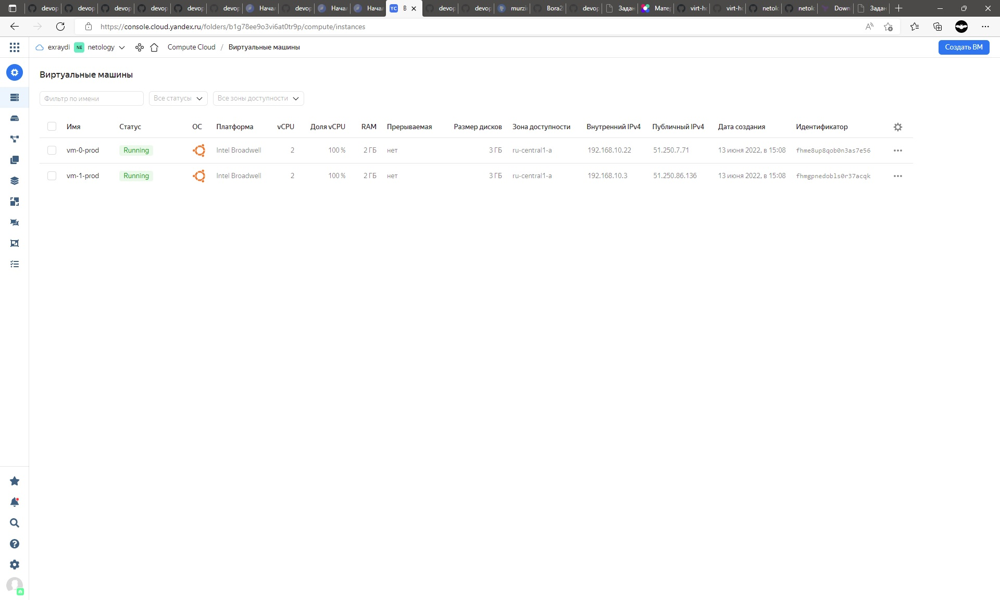

---


# Домашнее задание к занятию 7.2

1. Ответ на вопрос: при помощи какого инструмента (из разобранных на прошлом занятии) можно создать свой образ ami?

Можно использовать Packer. 


2.  


````commandline
vagrant@vagrant:~/terraform72$ sudo yc config list
token: 
cloud-id: b1gh69h18og7s3s213ih
folder-id: b1g78ee9o3vi6at0tr9p
compute-default-zone: ru-central1-a


````


terraform init

```
vagrant@vagrant:~/terraform72$ terraform13 init

Initializing the backend...

Initializing provider plugins...
- Finding latest version of yandex-cloud/yandex...
- Installing yandex-cloud/yandex v0.75.0...
- Installed yandex-cloud/yandex v0.75.0 (unauthenticated)

The following providers do not have any version constraints in configuration,
so the latest version was installed.

To prevent automatic upgrades to new major versions that may contain breaking
changes, we recommend adding version constraints in a required_providers block
in your configuration, with the constraint strings suggested below.

* yandex-cloud/yandex: version = "~> 0.75.0"


Warning: Interpolation-only expressions are deprecated

  on main.tf line 50, in resource "yandex_compute_instance" "vm-count":
  50:       image_id = "${yandex_compute_image.ubu-img.id}"

Terraform 0.11 and earlier required all non-constant expressions to be
provided via interpolation syntax, but this pattern is now deprecated. To
silence this warning, remove the "${ sequence from the start and the }"
sequence from the end of this expression, leaving just the inner expression.

Template interpolation syntax is still used to construct strings from
expressions when the template includes multiple interpolation sequences or a
mixture of literal strings and interpolations. This deprecation applies only
to templates that consist entirely of a single interpolation sequence.

(and one more similar warning elsewhere)

Terraform has been successfully initialized!

You may now begin working with Terraform. Try running "terraform plan" to see
any changes that are required for your infrastructure. All Terraform commands
should now work.

If you ever set or change modules or backend configuration for Terraform,
rerun this command to reinitialize your working directory. If you forget, other
commands will detect it and remind you to do so if necessary.
vagrant@vagrant:~/terraform72$
```

terraform plan

```
vagrant@vagrant:~/terraform72$ terraform13 plan
Refreshing Terraform state in-memory prior to plan...
The refreshed state will be used to calculate this plan, but will not be
persisted to local or remote state storage.

yandex_compute_image.ubu-img: Refreshing state... [id=fd8icqkptav0mt602cmo]
yandex_vpc_network.net: Refreshing state... [id=enpsovgssvsjcv81v6fa]
yandex_compute_instance.vm-for["2"]: Refreshing state... [id=fhmf0j52leem8v4j9gf7]
yandex_vpc_subnet.subnet: Refreshing state... [id=e9b4oiufo1n04286voe9]
yandex_compute_instance.vm-count[1]: Refreshing state... [id=fhm0ij64e0sbrqm0q03f]
yandex_compute_instance.vm-count[0]: Refreshing state... [id=fhmkq9vjdj3rjs2bnnlq]

------------------------------------------------------------------------

An execution plan has been generated and is shown below.
Resource actions are indicated with the following symbols:
  + create

Terraform will perform the following actions:

  # yandex_compute_image.ubu-img will be created
  + resource "yandex_compute_image" "ubu-img" {
      + created_at      = (known after apply)
      + folder_id       = (known after apply)
      + id              = (known after apply)
      + min_disk_size   = (known after apply)
      + name            = "ubuntu-20-04-lts-v20210908"
      + os_type         = (known after apply)
      + pooled          = (known after apply)
      + product_ids     = (known after apply)
      + size            = (known after apply)
      + source_disk     = (known after apply)
      + source_family   = (known after apply)
      + source_image    = "fd81hgrcv6lsnkremf32"
      + source_snapshot = (known after apply)
      + source_url      = (known after apply)
      + status          = (known after apply)
    }

  # yandex_compute_instance.vm-count[0] will be created
  + resource "yandex_compute_instance" "vm-count" {
      + created_at                = (known after apply)
      + folder_id                 = (known after apply)
      + fqdn                      = (known after apply)
      + hostname                  = (known after apply)
      + id                        = (known after apply)
      + name                      = "vm-0-prod"
      + network_acceleration_type = "standard"
      + platform_id               = "standard-v1"
      + service_account_id        = (known after apply)
      + status                    = (known after apply)
      + zone                      = (known after apply)

      + boot_disk {
          + auto_delete = true
          + device_name = (known after apply)
          + disk_id     = (known after apply)
          + mode        = (known after apply)

          + initialize_params {
              + block_size  = (known after apply)
              + description = (known after apply)
              + image_id    = (known after apply)
              + name        = (known after apply)
              + size        = (known after apply)
              + snapshot_id = (known after apply)
              + type        = "network-hdd"
            }
        }

      + network_interface {
          + index              = (known after apply)
          + ip_address         = (known after apply)
          + ipv4               = true
          + ipv6               = (known after apply)
          + ipv6_address       = (known after apply)
          + mac_address        = (known after apply)
          + nat                = true
          + nat_ip_address     = (known after apply)
          + nat_ip_version     = (known after apply)
          + security_group_ids = (known after apply)
          + subnet_id          = (known after apply)
        }

      + placement_policy {
          + placement_group_id = (known after apply)
        }

      + resources {
          + core_fraction = 100
          + cores         = 2
          + memory        = 2
        }

      + scheduling_policy {
          + preemptible = (known after apply)
        }
    }

  # yandex_compute_instance.vm-count[1] will be created
  + resource "yandex_compute_instance" "vm-count" {
      + created_at                = (known after apply)
      + folder_id                 = (known after apply)
      + fqdn                      = (known after apply)
      + hostname                  = (known after apply)
      + id                        = (known after apply)
      + name                      = "vm-1-prod"
      + network_acceleration_type = "standard"
      + platform_id               = "standard-v1"
      + service_account_id        = (known after apply)
      + status                    = (known after apply)
      + zone                      = (known after apply)

      + boot_disk {
          + auto_delete = true
          + device_name = (known after apply)
          + disk_id     = (known after apply)
          + mode        = (known after apply)

          + initialize_params {
              + block_size  = (known after apply)
              + description = (known after apply)
              + image_id    = (known after apply)
              + name        = (known after apply)
              + size        = (known after apply)
              + snapshot_id = (known after apply)
              + type        = "network-hdd"
            }
        }

      + network_interface {
          + index              = (known after apply)
          + ip_address         = (known after apply)
          + ipv4               = true
          + ipv6               = (known after apply)
          + ipv6_address       = (known after apply)
          + mac_address        = (known after apply)
          + nat                = true
          + nat_ip_address     = (known after apply)
          + nat_ip_version     = (known after apply)
          + security_group_ids = (known after apply)
          + subnet_id          = (known after apply)
        }

      + placement_policy {
          + placement_group_id = (known after apply)
        }

      + resources {
          + core_fraction = 100
          + cores         = 2
          + memory        = 2
        }

      + scheduling_policy {
          + preemptible = (known after apply)
        }
    }

  # yandex_vpc_network.net will be created
  + resource "yandex_vpc_network" "net" {
      + created_at                = (known after apply)
      + default_security_group_id = (known after apply)
      + folder_id                 = (known after apply)
      + id                        = (known after apply)
      + labels                    = (known after apply)
      + name                      = "net"
      + subnet_ids                = (known after apply)
    }

  # yandex_vpc_subnet.subnet will be created
  + resource "yandex_vpc_subnet" "subnet" {
      + created_at     = (known after apply)
      + folder_id      = (known after apply)
      + id             = (known after apply)
      + labels         = (known after apply)
      + name           = "subnet"
      + network_id     = (known after apply)
      + v4_cidr_blocks = [
          + "192.168.10.0/24",
        ]
      + v6_cidr_blocks = (known after apply)
      + zone           = "ru-central1-a"
    }

Plan: 5 to add, 0 to change, 0 to destroy.

Changes to Outputs:
  ~ yandex_ip_private = [
      - "192.168.10.26",
      - "192.168.10.30",
      + (known after apply),
      + (known after apply),
    ]
  ~ yandex_vpc_subnet = [
      - "e9b4oiufo1n04286voe9",
      + (known after apply),
    ]
  ~ yandex_zone       = [
      - "ru-central1-a",
      - "ru-central1-a",
      + (known after apply),
      + (known after apply),
    ]

Warning: Interpolation-only expressions are deprecated

  on main.tf line 51, in resource "yandex_compute_instance" "vm-count":
  51:       image_id = "${yandex_compute_image.ubu-img.id}"

Terraform 0.11 and earlier required all non-constant expressions to be
provided via interpolation syntax, but this pattern is now deprecated. To
silence this warning, remove the "${ sequence from the start and the }"
sequence from the end of this expression, leaving just the inner expression.

Template interpolation syntax is still used to construct strings from
expressions when the template includes multiple interpolation sequences or a
mixture of literal strings and interpolations. This deprecation applies only
to templates that consist entirely of a single interpolation sequence.


------------------------------------------------------------------------

Note: You didn't specify an "-out" parameter to save this plan, so Terraform
can't guarantee that exactly these actions will be performed if
"terraform apply" is subsequently run.
```

terraform apply

```
vagrant@vagrant:~/terraform72$ terraform13 apply
yandex_compute_image.ubu-img: Refreshing state... [id=fd8icqkptav0mt602cmo]
yandex_vpc_network.net: Refreshing state... [id=enpsovgssvsjcv81v6fa]
yandex_compute_instance.vm-for["2"]: Refreshing state... [id=fhmf0j52leem8v4j9gf7]
yandex_vpc_subnet.subnet: Refreshing state... [id=e9b4oiufo1n04286voe9]
yandex_compute_instance.vm-count[0]: Refreshing state... [id=fhmkq9vjdj3rjs2bnnlq]
yandex_compute_instance.vm-count[1]: Refreshing state... [id=fhm0ij64e0sbrqm0q03f]

An execution plan has been generated and is shown below.
Resource actions are indicated with the following symbols:
  + create

Terraform will perform the following actions:

  # yandex_compute_image.ubu-img will be created
  + resource "yandex_compute_image" "ubu-img" {
      + created_at      = (known after apply)
      + folder_id       = (known after apply)
      + id              = (known after apply)
      + min_disk_size   = (known after apply)
      + name            = "ubuntu-20-04-lts-v20210908"
      + os_type         = (known after apply)
      + pooled          = (known after apply)
      + product_ids     = (known after apply)
      + size            = (known after apply)
      + source_disk     = (known after apply)
      + source_family   = (known after apply)
      + source_image    = "fd81hgrcv6lsnkremf32"
      + source_snapshot = (known after apply)
      + source_url      = (known after apply)
      + status          = (known after apply)
    }

  # yandex_compute_instance.vm-count[0] will be created
  + resource "yandex_compute_instance" "vm-count" {
      + created_at                = (known after apply)
      + folder_id                 = (known after apply)
      + fqdn                      = (known after apply)
      + hostname                  = (known after apply)
      + id                        = (known after apply)
      + name                      = "vm-0-prod"
      + network_acceleration_type = "standard"
      + platform_id               = "standard-v1"
      + service_account_id        = (known after apply)
      + status                    = (known after apply)
      + zone                      = (known after apply)

      + boot_disk {
          + auto_delete = true
          + device_name = (known after apply)
          + disk_id     = (known after apply)
          + mode        = (known after apply)

          + initialize_params {
              + block_size  = (known after apply)
              + description = (known after apply)
              + image_id    = (known after apply)
              + name        = (known after apply)
              + size        = (known after apply)
              + snapshot_id = (known after apply)
              + type        = "network-hdd"
            }
        }

      + network_interface {
          + index              = (known after apply)
          + ip_address         = (known after apply)
          + ipv4               = true
          + ipv6               = (known after apply)
          + ipv6_address       = (known after apply)
          + mac_address        = (known after apply)
          + nat                = true
          + nat_ip_address     = (known after apply)
          + nat_ip_version     = (known after apply)
          + security_group_ids = (known after apply)
          + subnet_id          = (known after apply)
        }

      + placement_policy {
          + placement_group_id = (known after apply)
        }

      + resources {
          + core_fraction = 100
          + cores         = 2
          + memory        = 2
        }

      + scheduling_policy {
          + preemptible = (known after apply)
        }
    }

  # yandex_compute_instance.vm-count[1] will be created
  + resource "yandex_compute_instance" "vm-count" {
      + created_at                = (known after apply)
      + folder_id                 = (known after apply)
      + fqdn                      = (known after apply)
      + hostname                  = (known after apply)
      + id                        = (known after apply)
      + name                      = "vm-1-prod"
      + network_acceleration_type = "standard"
      + platform_id               = "standard-v1"
      + service_account_id        = (known after apply)
      + status                    = (known after apply)
      + zone                      = (known after apply)

      + boot_disk {
          + auto_delete = true
          + device_name = (known after apply)
          + disk_id     = (known after apply)
          + mode        = (known after apply)

          + initialize_params {
              + block_size  = (known after apply)
              + description = (known after apply)
              + image_id    = (known after apply)
              + name        = (known after apply)
              + size        = (known after apply)
              + snapshot_id = (known after apply)
              + type        = "network-hdd"
            }
        }

      + network_interface {
          + index              = (known after apply)
          + ip_address         = (known after apply)
          + ipv4               = true
          + ipv6               = (known after apply)
          + ipv6_address       = (known after apply)
          + mac_address        = (known after apply)
          + nat                = true
          + nat_ip_address     = (known after apply)
          + nat_ip_version     = (known after apply)
          + security_group_ids = (known after apply)
          + subnet_id          = (known after apply)
        }

      + placement_policy {
          + placement_group_id = (known after apply)
        }

      + resources {
          + core_fraction = 100
          + cores         = 2
          + memory        = 2
        }

      + scheduling_policy {
          + preemptible = (known after apply)
        }
    }

  # yandex_vpc_network.net will be created
  + resource "yandex_vpc_network" "net" {
      + created_at                = (known after apply)
      + default_security_group_id = (known after apply)
      + folder_id                 = (known after apply)
      + id                        = (known after apply)
      + labels                    = (known after apply)
      + name                      = "net"
      + subnet_ids                = (known after apply)
    }

  # yandex_vpc_subnet.subnet will be created
  + resource "yandex_vpc_subnet" "subnet" {
      + created_at     = (known after apply)
      + folder_id      = (known after apply)
      + id             = (known after apply)
      + labels         = (known after apply)
      + name           = "subnet"
      + network_id     = (known after apply)
      + v4_cidr_blocks = [
          + "192.168.10.0/24",
        ]
      + v6_cidr_blocks = (known after apply)
      + zone           = "ru-central1-a"
    }

Plan: 5 to add, 0 to change, 0 to destroy.

Changes to Outputs:
  ~ yandex_ip_private = [
      - "192.168.10.26",
      - "192.168.10.30",
      + (known after apply),
      + (known after apply),
    ]
  ~ yandex_vpc_subnet = [
      - "e9b4oiufo1n04286voe9",
      + (known after apply),
    ]
  ~ yandex_zone       = [
      - "ru-central1-a",
      - "ru-central1-a",
      + (known after apply),
      + (known after apply),
    ]


Warning: Interpolation-only expressions are deprecated

  on main.tf line 51, in resource "yandex_compute_instance" "vm-count":
  51:       image_id = "${yandex_compute_image.ubu-img.id}"

Terraform 0.11 and earlier required all non-constant expressions to be
provided via interpolation syntax, but this pattern is now deprecated. To
silence this warning, remove the "${ sequence from the start and the }"
sequence from the end of this expression, leaving just the inner expression.

Template interpolation syntax is still used to construct strings from
expressions when the template includes multiple interpolation sequences or a
mixture of literal strings and interpolations. This deprecation applies only
to templates that consist entirely of a single interpolation sequence.

Do you want to perform these actions in workspace "prod"?
  Terraform will perform the actions described above.
  Only 'yes' will be accepted to approve.

  Enter a value: yes

yandex_vpc_network.net: Creating...
yandex_compute_image.ubu-img: Creating...
yandex_vpc_network.net: Creation complete after 1s [id=enpg44ts280artc1bfch]
yandex_vpc_subnet.subnet: Creating...
yandex_vpc_subnet.subnet: Creation complete after 0s [id=e9bhvmpb7ipecl5ruv73]
yandex_compute_image.ubu-img: Still creating... [10s elapsed]
yandex_compute_image.ubu-img: Still creating... [20s elapsed]
yandex_compute_image.ubu-img: Creation complete after 27s [id=fd88nm5uj8794ehmtbf5]
yandex_compute_instance.vm-count[0]: Creating...
yandex_compute_instance.vm-count[1]: Creating...
yandex_compute_instance.vm-count[0]: Still creating... [10s elapsed]
yandex_compute_instance.vm-count[1]: Still creating... [10s elapsed]
yandex_compute_instance.vm-count[0]: Still creating... [20s elapsed]
yandex_compute_instance.vm-count[1]: Still creating... [20s elapsed]
yandex_compute_instance.vm-count[0]: Still creating... [30s elapsed]
yandex_compute_instance.vm-count[1]: Still creating... [30s elapsed]
yandex_compute_instance.vm-count[1]: Still creating... [40s elapsed]
yandex_compute_instance.vm-count[0]: Still creating... [40s elapsed]
yandex_compute_instance.vm-count[1]: Creation complete after 42s [id=fhmgpnedobls0r37acqk]
yandex_compute_instance.vm-count[0]: Creation complete after 44s [id=fhme8up8qob0n3as7e56]

Apply complete! Resources: 5 added, 0 changed, 0 destroyed.

Outputs:

yandex_ip_private = [
  "192.168.10.22",
  "192.168.10.3",
]
yandex_vpc_subnet = [
  "e9bhvmpb7ipecl5ruv73",
]
yandex_zone = [
  "ru-central1-a",
  "ru-central1-a",
]
vagrant@vagrant:~/terraform72$

```


Содержимое main.tf

```
vagrant@vagrant:~/terraform72$ cat main.tf
terraform {
  required_providers {
    yandex = {
      source = "yandex-cloud/yandex"
      version = "~> 0.70.0"
    }
  }
  required_version =  ">= 0.13"
}

provider yandex {
  token     = ""
  cloud_id  = "b1gh69h18og7s3s213ih"
  folder_id = "b1g78ee9o3vi6at0tr9p"
  zone      = "ru-central1-a"
}

resource yandex_compute_image ubu-img {
  name          = "ubuntu-20-04-lts-v20210908"
  source_image  = "fd81hgrcv6lsnkremf32"
}

resource "yandex_vpc_network" "net" {
  name = "net"
}

resource "yandex_vpc_subnet" "subnet" {
  name           = "subnet"
  zone           = "ru-central1-a"
  network_id     = yandex_vpc_network.net.id
  v4_cidr_blocks = ["192.168.10.0/24"]
}

locals {
  instance = {
  stage = 1
  prod = 2
  }
}

resource "yandex_compute_instance" "vm-count" {
  name = "vm-${count.index}-${terraform.workspace}"

  resources {
    cores  = "2"
    memory = "2"
  }

  boot_disk {
    initialize_params {
      image_id = "${yandex_compute_image.ubu-img.id}"
    }
  }

  network_interface {
    subnet_id = yandex_vpc_subnet.subnet.id
    nat       = true
  }

  count = local.instance[terraform.workspace]
}

locals {
  id = toset([
    "1",
    "2",
  ])
}

```

Содержимое output.tf

```
vagrant@vagrant:~/terraform72$ cat outputs.tf
output "yandex_zone" {
  value       = yandex_compute_instance.vm-count[*].zone
}

output "yandex_ip_private" {
  value       = yandex_compute_instance.vm-count[*].network_interface.0.ip_address
}

output "yandex_vpc_subnet" {
  value       = yandex_vpc_subnet.subnet[*].id
}
vagrant@vagrant:~/terraform72$
```

Исходники 
[https://github.com/Exraydi/devops-netology/72src](72src)

