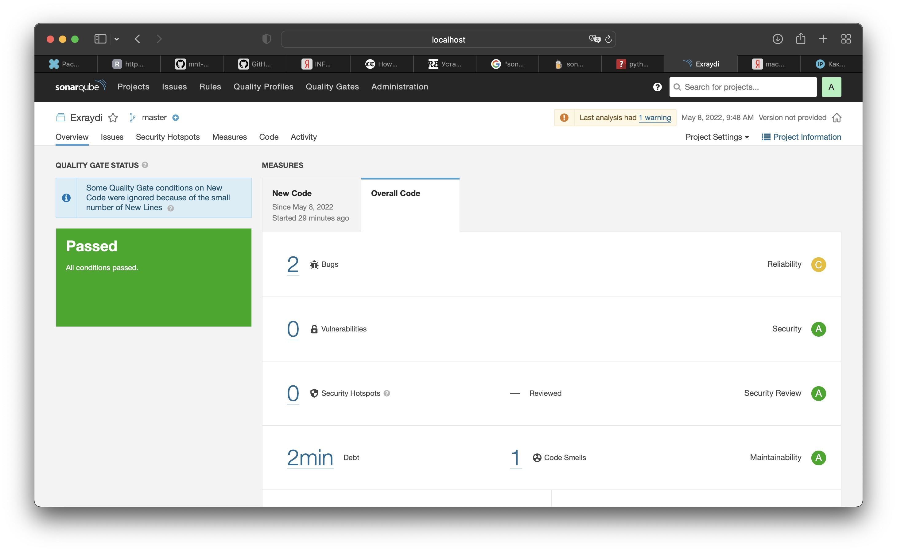
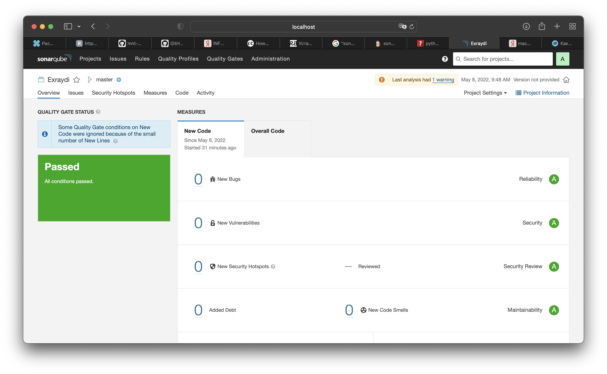

---


# Домашнее задание к занятию 9.2
## Обязательная задача 1



```
Первый прогон. С ошибкой.
```




```
Второй прогон. После исправления ошибки.
```


## Обязательная задача 2

```
<metadata modelVersion="1.1.0">
<groupId>netology</groupId>
<artifactId>java</artifactId>
<versioning>
<latest>8_282</latest>
<release>8_282</release>
<versions>
<version>8_102</version>
<version>8_282</version>
</versions>
<lastUpdated>20220509093750</lastUpdated>
</versioning>
</metadata>


```

[https://github.com/Exraydi/devops-netology/maven-metadata.xml](maven-metadata.xml)


## Обязательная задача 3

```
vagrant@vagrant:/home/maven/apache-maven-3.8.5/bin$ mvn --version
Apache Maven 3.8.5 (3599d3414f046de2324203b78ddcf9b5e4388aa0)
Maven home: /home/maven/apache-maven-3.8.5
Java version: 11.0.15, vendor: Private Build, runtime: /usr/lib/jvm/java-11-openjdk-amd64
Default locale: en_US, platform encoding: UTF-8
OS name: "linux", version: "5.4.0-80-generic", arch: "amd64", family: "unix"
vagrant@vagrant:/home/maven/apache-maven-3.8.5/bin$

root@vagrant:/tmp/pom# mvn package
[INFO] Scanning for projects...
[INFO]
[INFO] --------------------< com.netology.app:simple-app >---------------------
[INFO] Building simple-app 1.0-SNAPSHOT
[INFO] --------------------------------[ jar ]---------------------------------
Downloading from my-repo: http://localhost:8081/repository/maven-public/netology/java/8_282/java-8_282.pom
Downloading from central: https://repo.maven.apache.org/maven2/netology/java/8_282/java-8_282.pom
[WARNING] The POM for netology:java:tar.gz:distrib:8_282 is missing, no dependency information available
Downloading from my-repo: http://localhost:8081/repository/maven-public/netology/java/8_282/java-8_282-distrib.tar.gz
Downloaded from my-repo: http://localhost:8081/repository/maven-public/netology/java/8_282/java-8_282-distrib.tar.gz (329 B at 19 kB/s)
[INFO]
[INFO] --- maven-resources-plugin:2.6:resources (default-resources) @ simple-app ---
[WARNING] Using platform encoding (UTF-8 actually) to copy filtered resources, i.e. build is platform dependent!
[INFO] skip non existing resourceDirectory /tmp/pom/src/main/resources
[INFO]
[INFO] --- maven-compiler-plugin:3.1:compile (default-compile) @ simple-app ---
[INFO] No sources to compile
[INFO]
[INFO] --- maven-resources-plugin:2.6:testResources (default-testResources) @ simple-app ---
[WARNING] Using platform encoding (UTF-8 actually) to copy filtered resources, i.e. build is platform dependent!
[INFO] skip non existing resourceDirectory /tmp/pom/src/test/resources
[INFO]
[INFO] --- maven-compiler-plugin:3.1:testCompile (default-testCompile) @ simple-app ---
[INFO] No sources to compile
[INFO]
[INFO] --- maven-surefire-plugin:2.12.4:test (default-test) @ simple-app ---
[INFO] No tests to run.
[INFO]
[INFO] --- maven-jar-plugin:2.4:jar (default-jar) @ simple-app ---
[WARNING] JAR will be empty - no content was marked for inclusion!
[INFO] Building jar: /tmp/pom/target/simple-app-1.0-SNAPSHOT.jar
[INFO] ------------------------------------------------------------------------
[INFO] BUILD SUCCESS
[INFO] ------------------------------------------------------------------------
[INFO] Total time:  1.400 s
[INFO] Finished at: 2022-05-09T13:59:08+03:00
[INFO] ------------------------------------------------------------------------

root@vagrant:/tmp/pom# ls -la ~/.m2/repository/netology/java/8_282/
total 24
drwxr-xr-x 2 root root 4096 May  9 13:59 .
drwxr-xr-x 3 root root 4096 May  9 13:59 ..
-rw-r--r-- 1 root root  329 May  9 13:59 java-8_282-distrib.tar.gz
-rw-r--r-- 1 root root   40 May  9 13:59 java-8_282-distrib.tar.gz.sha1
-rw-r--r-- 1 root root  382 May  9 13:59 java-8_282.pom.lastUpdated
-rw-r--r-- 1 root root  175 May  9 13:59 _remote.repositories
root@vagrant:/tmp/pom#

```
[https://github.com/Exraydi/devops-netology/pom.xml](pom.xml)