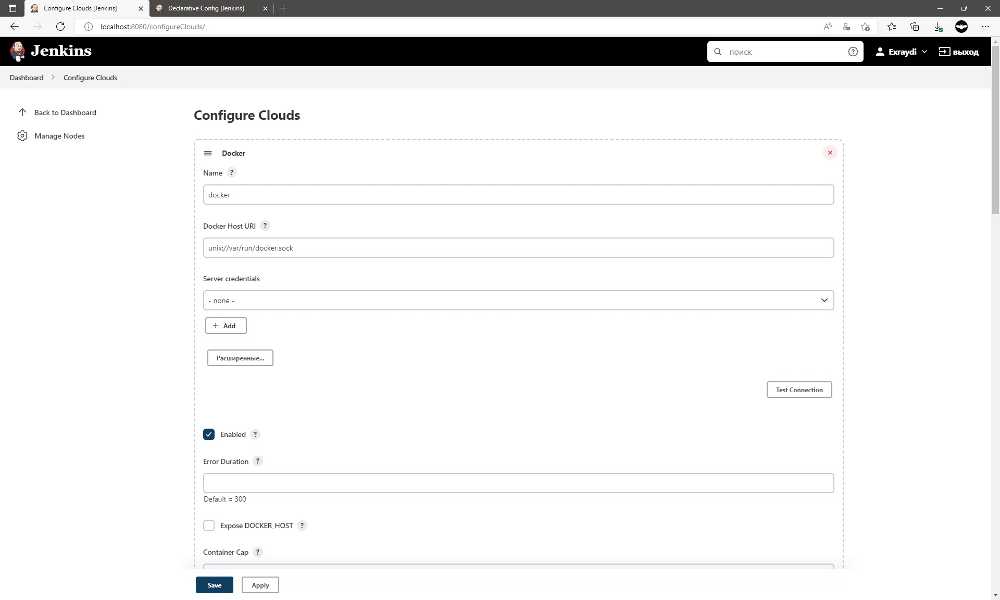
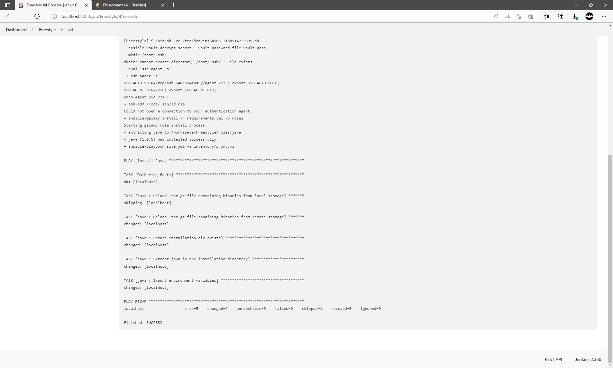
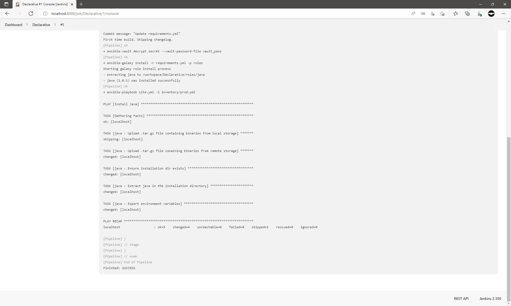
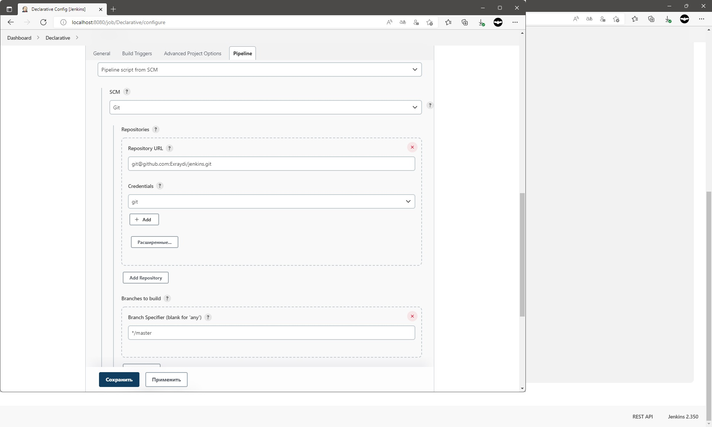
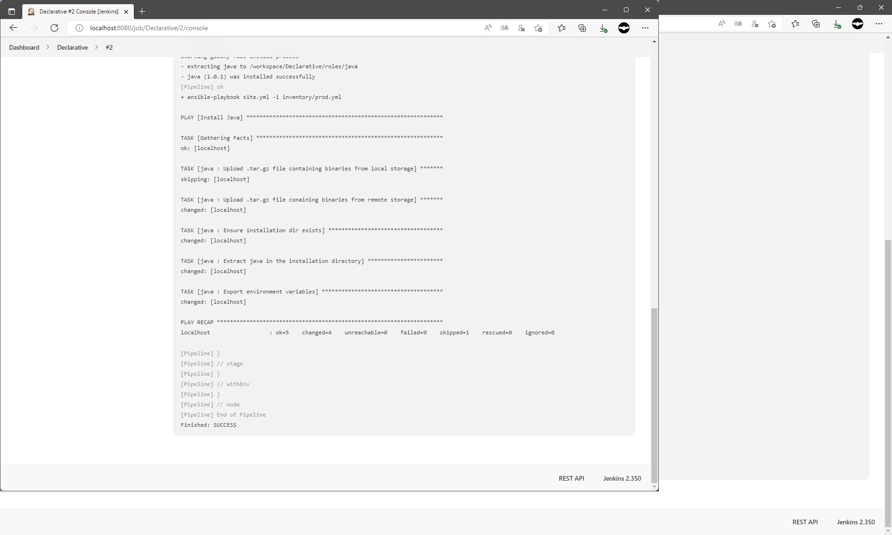
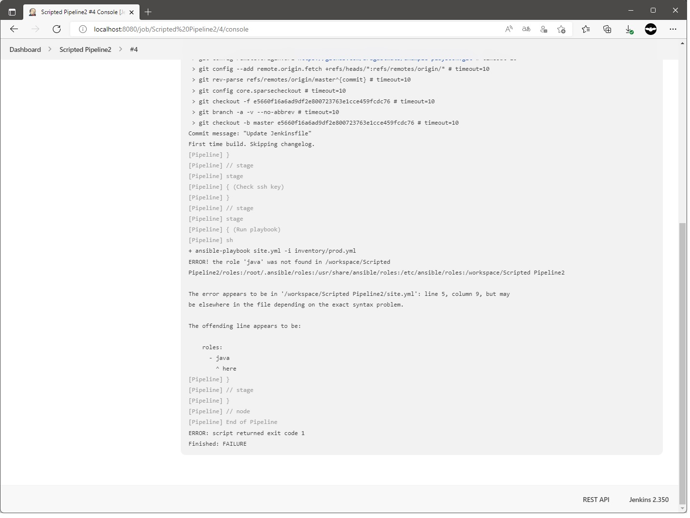
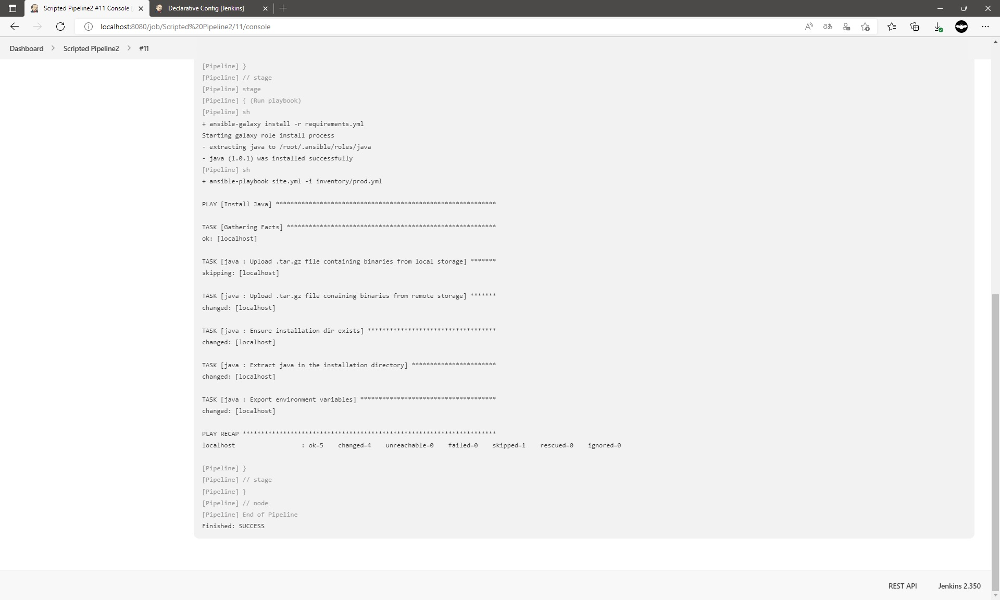
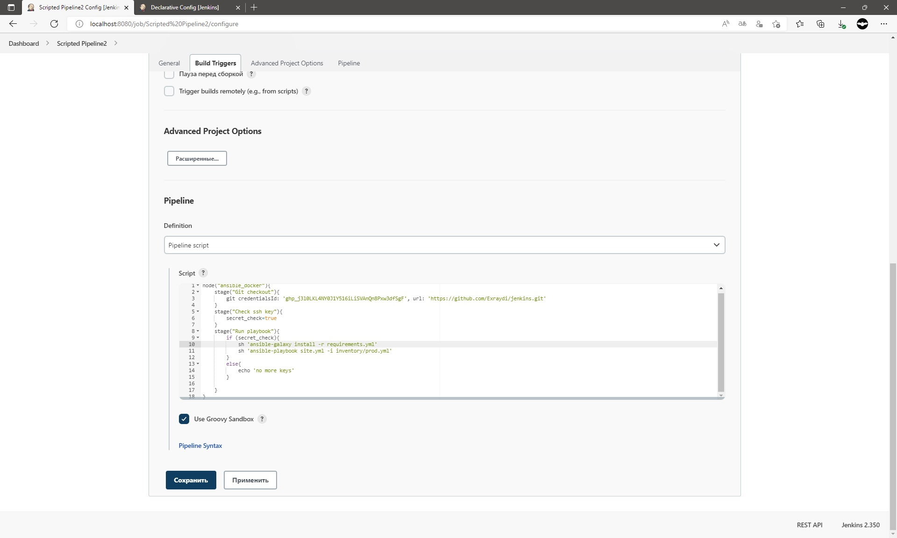

---


# Домашнее задание к занятию 9.3
## Поднята инфраструктура Jenkins на Vagrant из Docker compose файла. 

````commandline
vagrant@vagrant:~/jenkins$ cat docker-compose.yml
version: '3.8'
services:
    jenkins:
        image: jenkins/jenkins:latest-jdk11
        privileged: true
        user: root
        ports:
                - 8080:8080
                - 50000:50000
        container_name: jenkins
        volumes:
                - $HOME/jenkins_compose/jenkins_configuration:/var/jenkins_home
                - /var/run/docker.sock:/var/run/docker.sock

vagrant@vagrant:~/jenkins$
````
```
Работа 

vagrant@vagrant:~/jenkins$ sudo docker compose ps
NAME                COMMAND                  SERVICE             STATUS              PORTS
jenkins             "/usr/bin/tini -- /u…"   jenkins             running             0.0.0.0:8080->8080/tcp, 0.0.0.0:50000->50000/tcp, :::8080->8080/tcp, :::50000->50000/tcp
vagrant@vagrant:~/jenkins$

```


Скиншоты основных моментов выполения ДЗ ниже: 


Настроено под свои нужды



1. Сделать Freestyle Job, который будет запускать ansible-playbook из форка репозитория



2. Сделать Declarative Pipeline, который будет выкачивать репозиторий с плейбукой и запускать её



3. Перенести Declarative Pipeline в репозиторий в файл Jenkinsfile



4. Перенастроить Job на использование Jenkinsfile из репозитория



5. Создать Scripted Pipeline, наполнить его скриптом из pipeline
   Заменить credentialsId на свой собственный
   Проверить работоспособность, исправить ошибки, исправленный Pipeline вложить в репозитрий в файл ScriptedJenkinsfile






Итог: 
Ссылка на ScriptedJenkinsfile
https://github.com/Exraydi/jenkins/ScriptedJenkinsfile

