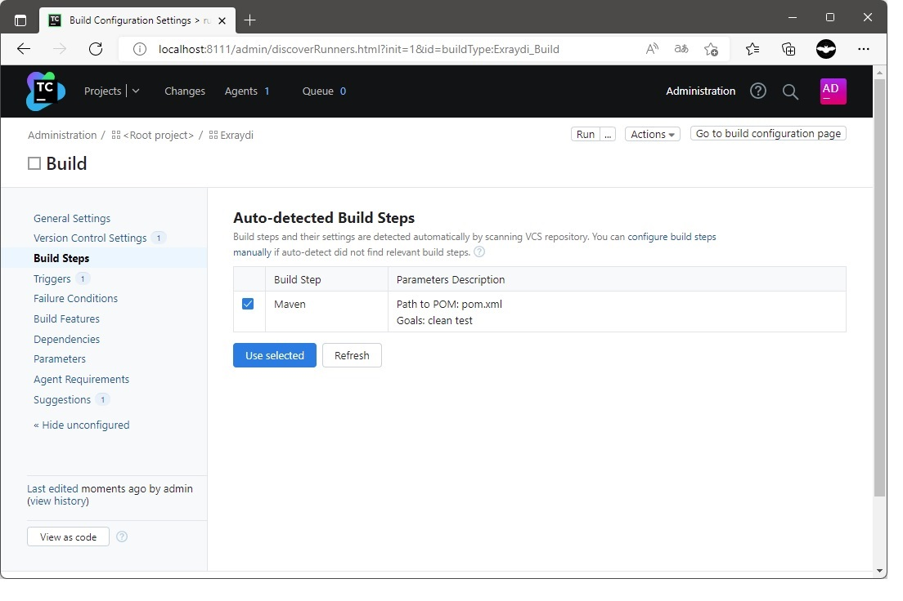
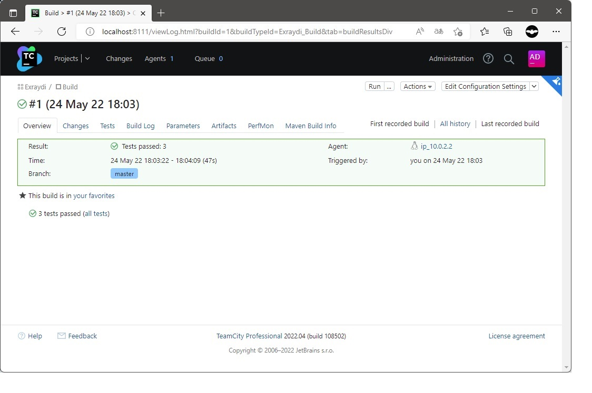
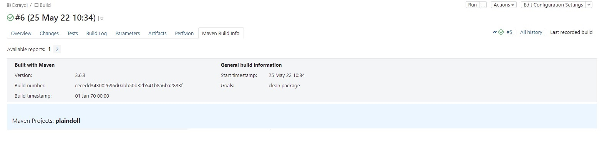
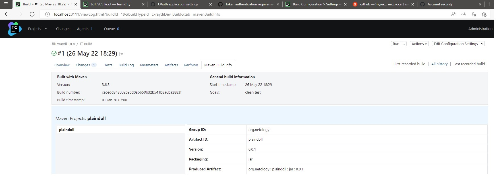
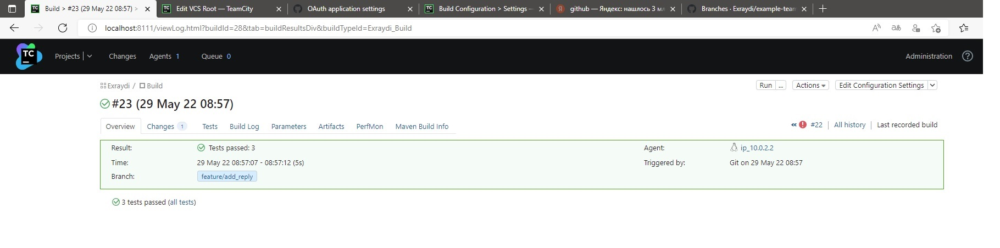
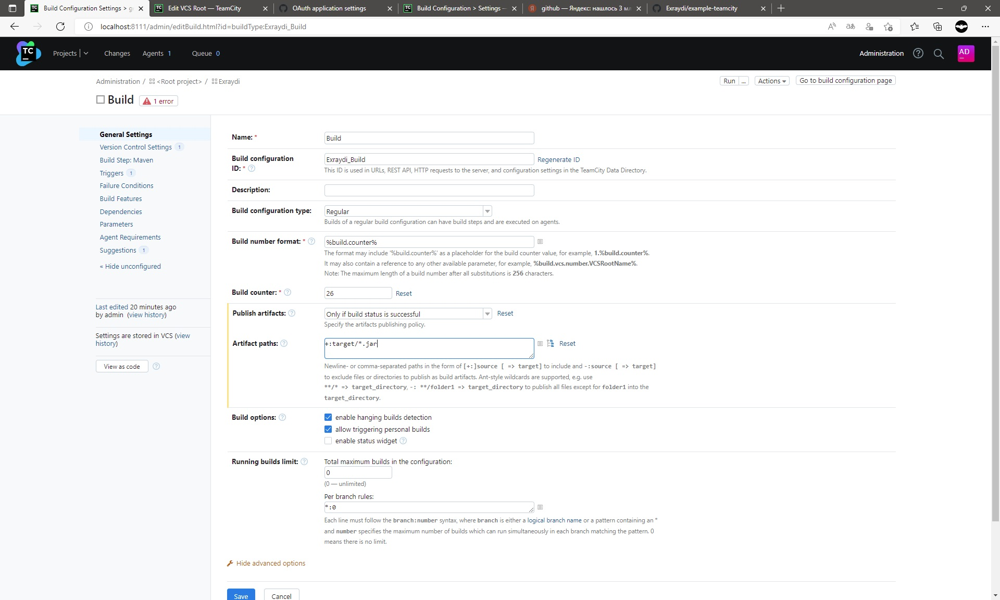
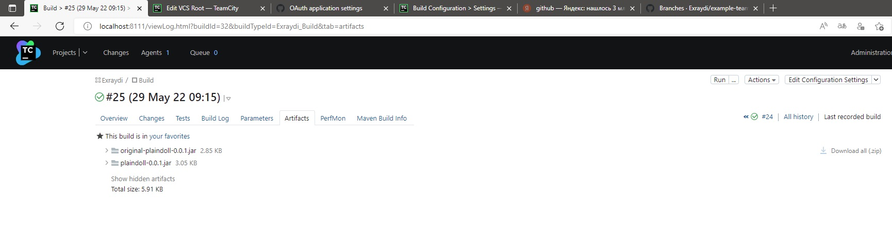

---


# Домашнее задание к занятию 9.4
## Поднята инфраструктура Teamcity на Vagrant из Docker образов. 

````commandline
vagrant@vagrant:~/teamcity/example-teamcity$ sudo docker ps
CONTAINER ID   IMAGE                       COMMAND              CREATED      STATUS      PORTS                                       NAMES
f1c28a6ff1b0   jetbrains/teamcity-agent    "/run-services.sh"   4 days ago   Up 4 days                                               heuristic_jones
6f8d35d0610e   jetbrains/teamcity-server   "/run-services.sh"   4 days ago   Up 4 days   0.0.0.0:8111->8111/tcp, :::8111->8111/tcp   teamcity-server

````

Скиншоты основных моментов выполения ДЗ ниже: 




Первый прогон master-а



mvn clean package



mvn clean test



Отдельная ветка feature/add_reply



Сборка артифактов 



Итог




Ссылка на репозиторий 
https://github.com/Exraydi/example-teamcity.git

